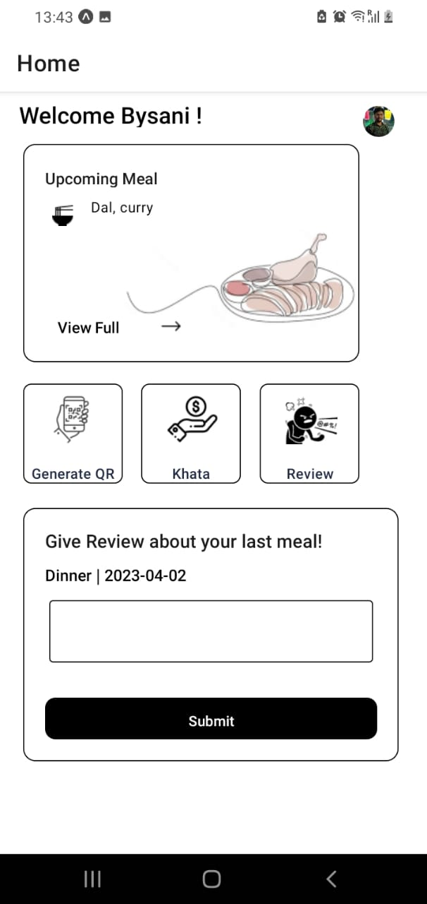
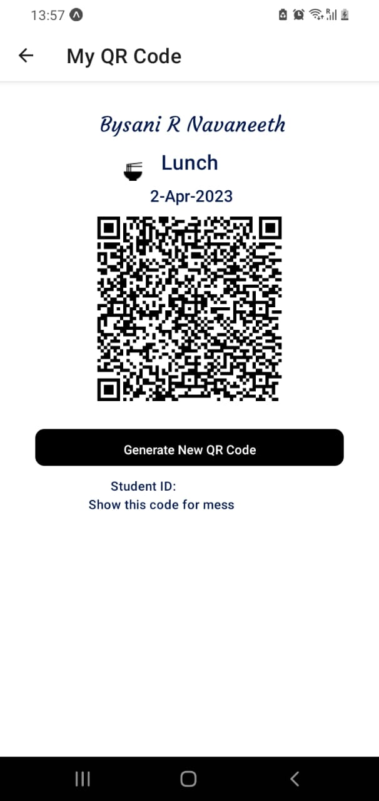
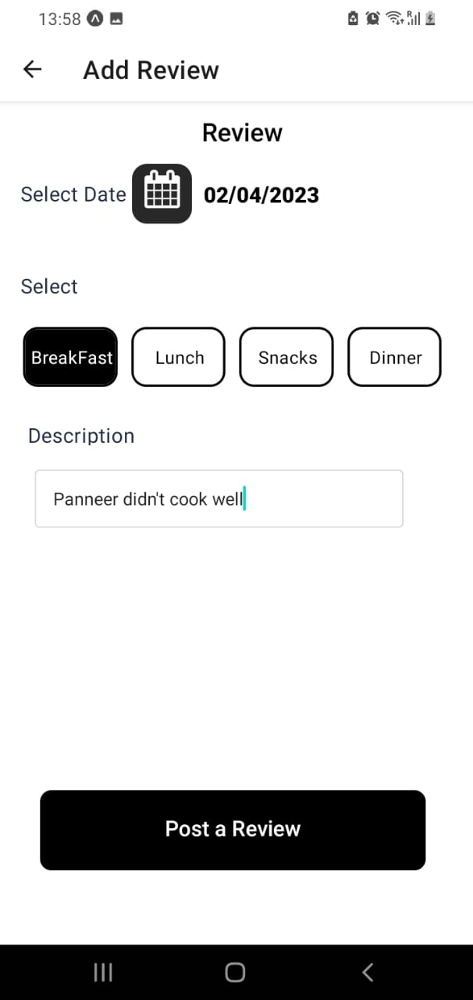
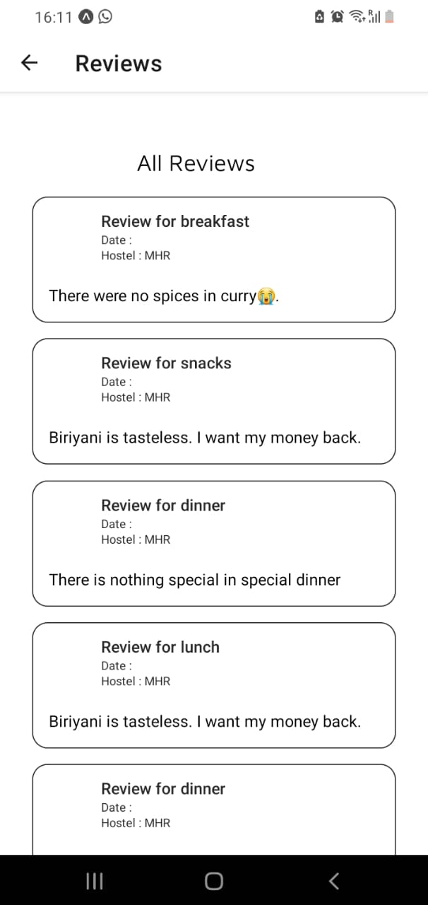
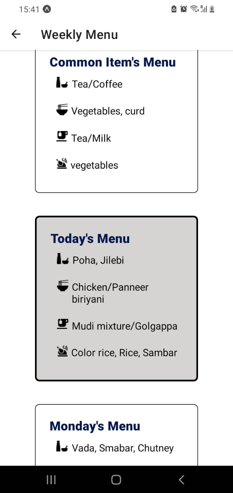
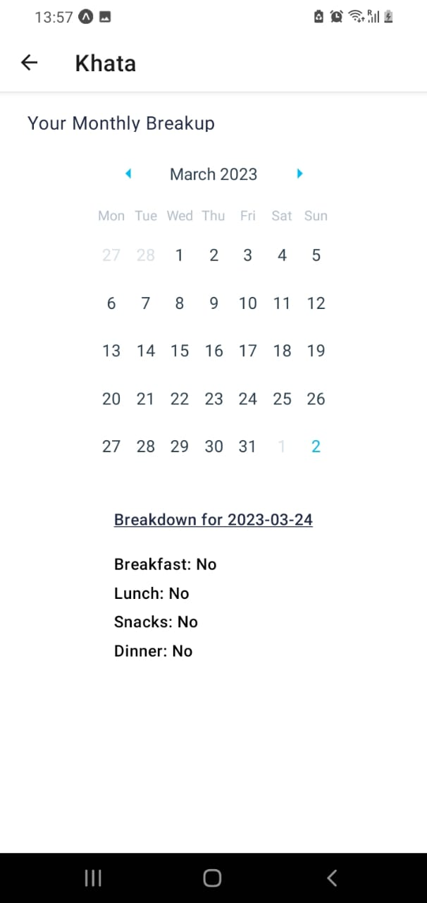
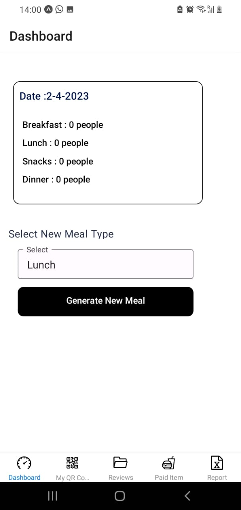
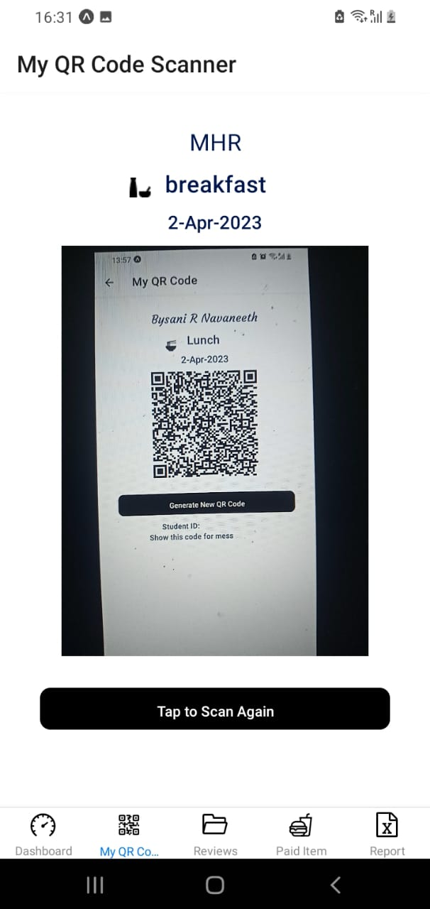
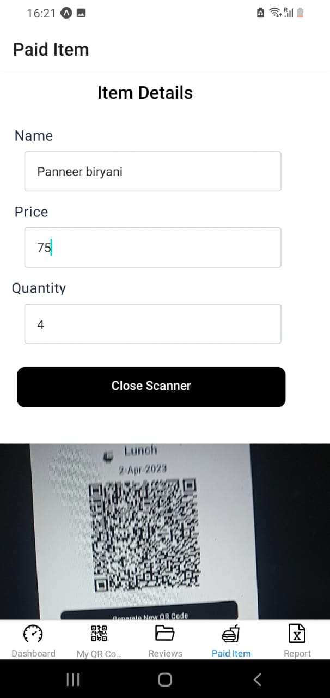
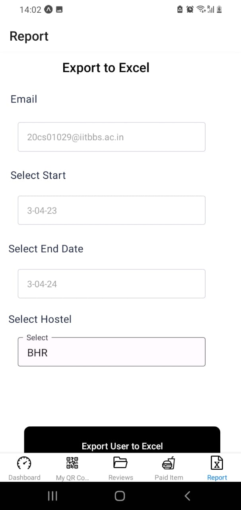

# MessKhata

The MessKhata mobile app is designed to track the mess attendance of students at IIT Bhubaneswar. It was developed by a team during the **GC_SDE_Hackathon'23**, an annual inter-branch Hackathon organized by IIT Bhubaneswar as part of the General Championship. 

The team won **first** place in the competition.

## Problem Statement

The app addresses the issue of the mess attendance system. Currently, students are charged for all four mess meals every day, regardless of how many times they actually dine in the mess. Moreover, mess managers face the challenge of some students taking multiple servings of limited-quantity food items. The goal is to design a mobile-based software solution to tackle these problems.

## Technologies Used

The MessKhata app utilizes the following technologies:

- Node.js: Evented I/O for the backend
- Express: Fast node.js network app framework
- MongoDB: NoSQL database
- React Native: JavaScript library for building user interfaces
- Google OAuth: Open Authorization from Google
- Google Sheets API: Google's API for interacting with Google Sheets

## Features

### Features for Students

Students using the MessKhata app can:

- Login using their institute email ID
- Mark their mess attendance using a QR code
- Leave meal reviews or complaints
- View the weekly menu
- Access their meal "Khata" (attendance record)

### Features for Mess Managers

Mess managers using the MessKhata app can:

- Login using predefined email IDs
- Scan QR codes to mark students' attendance
- View meal reviews or complaints
- Sell extra paid items directly in the app
- Generate mess attendance into Excel format

## Functionality Overview

### Student's View

The app provides various features for students, including:

- **Homepage**: Displays the upcoming meal and its menu. Students can leave a review about their last meal directly from the homepage.

    

<!--  -->

- **Attendance**: Shows the QR code while availing meals. QR codes are generated with symmetric key encryption and are valid for 4 hours. Scanning a QR code updates the student's account balance.

    

- **Review**: Allows students to add reviews or complaints about specific meals.

    

- **All Reviews**: Displays all the reviews posted by students, including the date and meal.

    

- **Weekly Menu**: Shows the weekly menu, highlighting the current day's menu.

    

- **Khata**: Displays the student's monthly attendance with a detailed breakdown for each day. It also shows a list of paid items purchased, enabling students to keep track of their billing even if they did not consume a meal.

    

### Mess Manager's View

The app provides various features for mess managers, including:

- **Dashboard**: Displays the count of students who have taken each meal on the current day. Mess managers can create a new meal, which is required to start scanning QR codes for attendance.

    

- **QR Scanner**: Allows mess managers to scan students' QR codes. Scanning a QR code twice for the same meal is not allowed, and QR codes from one hostel cannot be used in another.

    

- **Reviews**: Provides access to all the reviews posted by students, including the date and meal.

    

- **Paid Items**: Allows mess managers to enter the name, price, and quantity of extra paid items. They can scan the student's QR code to update the mess balance automatically.

    

- **Download Attendance**: Enables mess managers to input start and end dates, select the hostel, and export the attendance data to an Excel sheet.

    

### Highlights

The MessKhata app offers several highlights, including:

- Additional features beyond the compulsory requirements, such as Khata, download attendance, and purchase of extra items.
- Easier migration from regular systems: Data can be imported into the database through Google Sheets using the Google Sheets API. This facilitates the migration to a digital platform from the current system that uses Google Sheets for maintaining student data.
- Security-first approach: Measures like QR code expiry time and encryption ensure that others cannot misuse a student's QR code. Students from one hostel cannot avail food in another hostel.

## Demo Videos

Demo videos of the MessKhata app are available for the student's view and the mess manager's view.

- [Student’s View](https://drive.google.com/file/d/1FV1hpsv1byhEiXM-0V7X5NaRLjWrvWvL/view?usp=sharing)
- [Mess Manager’s View](https://drive.google.com/file/d/1FZapw1-7bmrw-LbGPgwKbYvj9wkyt7G-/view?usp=sharing)

## Team

The team behind the app consists of the following members:

- Shrirang Deshmukh
- Navaneeth Bysani
- Ritik Gupta
- Jatin Yadav